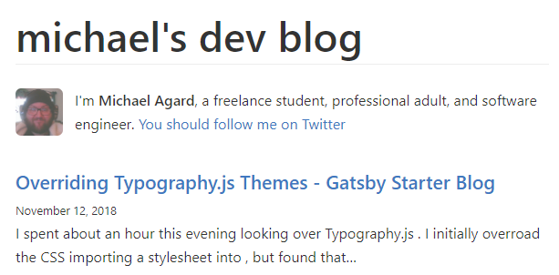

I spent about an hour this evening looking over [Typography.js](https://kyleamathews.github.io/typography.js/). I initially overroad the CSS importing a stylesheet into ```src/pages/index.js```, but found that the stylesheet wouldn't persist between routes. The proper way is to modify ```src/utils/typography.js```.

A basic ```typography.js``` file looks like this.

```
import Typography from 'typography'
import GitHub from 'typography-theme-github'

const typography = new Typography(GitHub)

// Hot reload typography in development.
if (process.env.NODE_ENV !== 'production') {
  typography.injectStyles()
}

export default typography
export const rhythm = typography.rhythm
export const scale = typography.scale
```

Here is an example of what my root route would look like.


The theme I'm using is ```typography-theme-github```, but I modified the color pallate to something easier on my eyes. By using ```.overrideThemeStyles``` you're able to add in styles as you would normally in a jsx file.

```
import Typography from 'typography'
// import Wordpress2016 from 'typography-theme-wordpress-2016'
import GitHub from 'typography-theme-github' // Not needed now

GitHub.overrideThemeStyles = () => ({
  'a.gatsby-resp-image-link': {
    boxShadow: 'none',
  },
  'body': {
    background: '#393f4d',
  },
  'p,a,small,li': {
    color: '#d4d4dc',
  },
  'h3': {
    color: '#d7d8db'
  },
  'h1,h2,h4,h5,h6': {
    color: '#d4d4dcda'
  },
  'small': {
    fontSize: '12px'
  },
  'a': {
    textDecoration: 'underline'
  },
  'code': {
    color: '#393f4d',
    backgroundColor: '#d4d4dc',
    lineHeight: '1.0',
    fontSize: '1'
  },
  'a:hover': {
    transition: '.2s',
    color: 'white'
  },
  'blockquote': {
    color: "grey",
    borderLeft: "10px solid #ccc",
  },
  '.gatsby-highlight': {
    background: '#d4d4dc',
    padding: '25px'
  }
})

delete GitHub.googleFonts

const typography = new Typography(GitHub)

// Hot reload typography in development.
if (process.env.NODE_ENV !== 'production') {
  typography.injectStyles()
}

export default typography
export const rhythm = typography.rhythm
export const scale = typography.scale
```