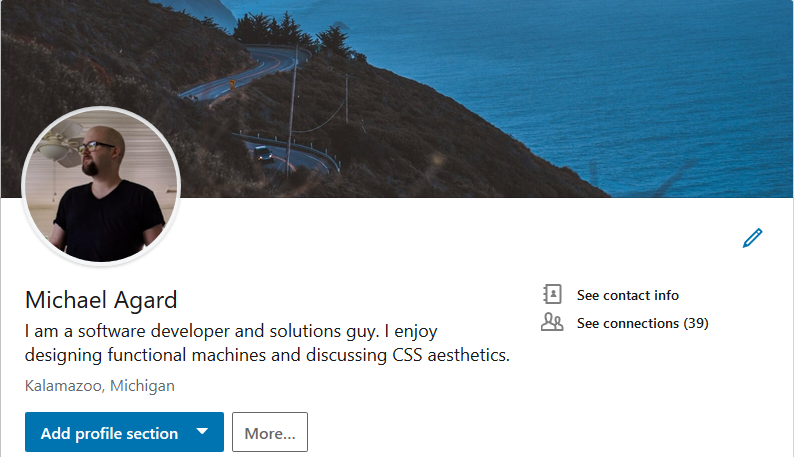

It's been a tough eight months, but I can finally consider myself a graduate of the [Lambda School Full Stack Web](https://lambdaschool.com/courses/cs/web/ "details of the full stack web course curriculum") course. Now all that is left is to hone my skills as a FSW developer and apply for work which feels odd since I've been in school for so long. I'm expectantly excited to start my new career.

To be honest, I'm already on week three, but I'm at a point where I can comfortably apply for work now that I'm officially endorsed by Lambda. This included sprucing up my [LinkedIn](https://www.linkedin.com/in/mdagard/ "michael agard's linkedin profile") and [resume](../../../resume "michael agard's online resume") to the point where I'm at least presentable to my peers.

## My Job Experience Thus Far

My biggest and only job opportunity this week is from a company based in Kalamazoo, Michigan called [Stryker](https://www.stryker.com/) which is a medical technology company. They approached me on LinkedIn in a private message and asked if I was interested in working as a project manager which I responded that I was open to the idea. The recruiter then scheduled a 20 minute phone conversation Friday afternoon. I'm a little taken back that within the first week I was approached by a recruiter but I assume since I'm new to the platform, this is just how it worked. People make money looking for other applicable people, and if you have the correct combination of words on your profile, you get more connections.

## The Phone Interview

So I mentioned a phone interview and I believe it went well. Big spoiler here, I didn't get the job. The recruiter was throwing a wide net and just assumed my 4 years of project management experience equated to me being able to spearhead a large multi billion dollar project. I'll go on record that I would agree putting me with my current skillset is not a smart idea. When I worked as a project manager with Pentius, I mainly micro managed a team of developers on an array of smaller projects.

I did however get some leads on a couple of entry level front end developer jobs near Wyoming, Michigan, which is like 40 minutes from where I'll be living for the next year. So I'd highly recommend talking to recruiters, understanding how they get their cut, and keeping them on speed dial. Their resources are insanely valuable and has tended to save me time in the long run on finding leads for new work.