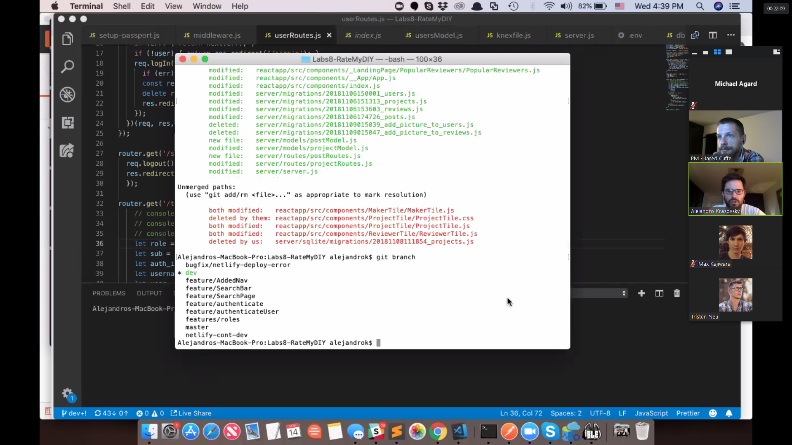
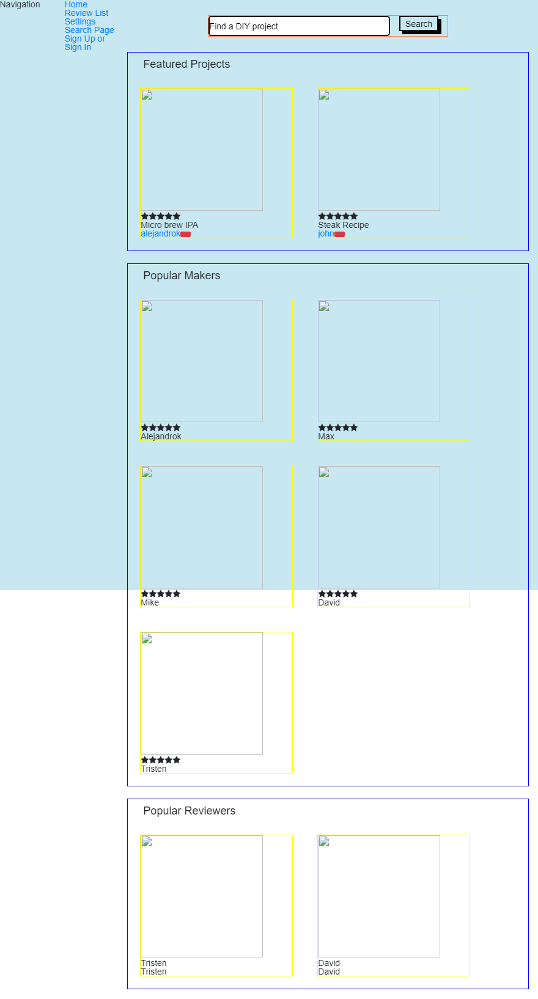
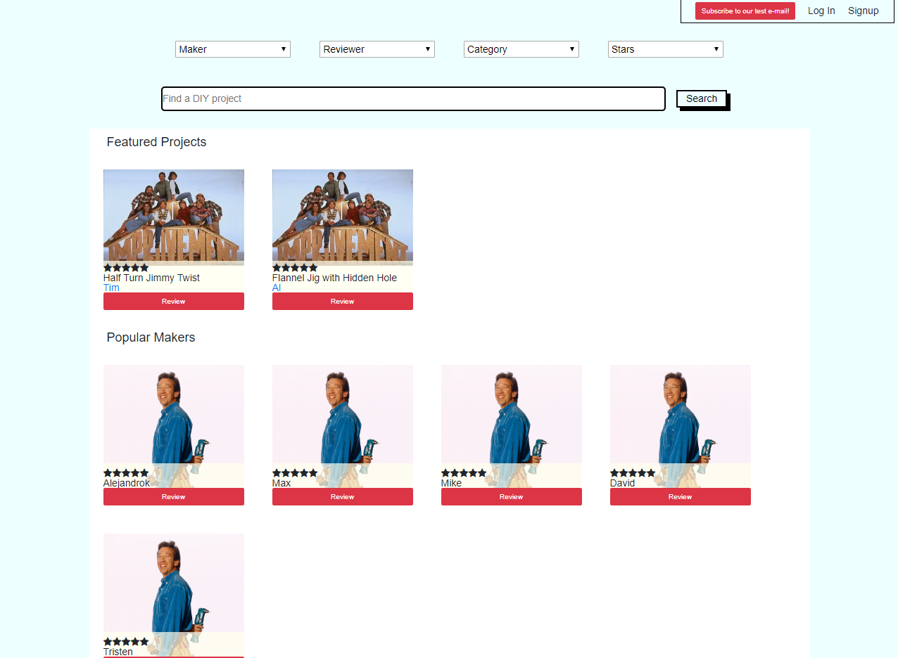

## Week 2
This week's theme is integration. We'll need to implement the required APIs need to connect our front end to our back end. We'll also be implementing OAuth using Auth0. Tuesday, we went over what we were able to complete last week on Auth0. We were able to get an API endpoint to hit that redirects you to Auth0 login. We want that process to be done within a modal from the landing page.

Wednesday and Thursday I revamped the landing page of the site's interface. Nothing major, just a little more represenative of the end product. I wrote it with flexbox in mind making each tile a strict 200px by 200px and show a dynamically sized image with the overflow hidden. CSS always seems to be trial and error occurance for me. I need to sharpen those skills more. I also factored the layout of the search bar wrapping the search bar and submit button in a containing div to line things up correctly. I also thuroughly messed up our GitHub timeline to the point where everyone had to resync with the two commits I deleted due to bad code. Shout out to Jared Cuffe for helping us out here! He is truely a git wizard. Lesson learned.

New design:

Thursday I continued to work on the front end, implementing a DropDown component that does not drop down yet since we haven't figured out authentication yet. Our group had our peer review from Punit and we failed miserably. The goal for the review was to have auth working, front and back end are connected, and we have implemented two external APIs. We didn't even know we needed to have external APIs, as we thought we just needed to connect to two different APIs, which one would have been Auth0 and the other was AWS S3. Speaking of which, I was able to finished up the setup of an AWS S3 account and successfully uploaded to the connected bucket. This was also the day I added basic SendGrid tests to be able to send a "subscription" email to our users.

Old design:

New design:

All in all, this week was still a good week even though we never accomplished the sprint challenge. I've learned a lot and we now know people in our labs have no idea how to implement auth0.