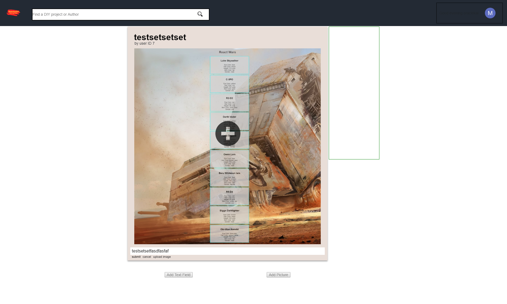

## Week 4
What a nice week compared to my last few weeks. Focusing on polishing has been a much nicer experience for the entire team. Since we're not working on heavily logic based issues, we've been able to just focus on the few fleshed out pages we have in place. I've been working on the project page, and getting feedback from the team, and so far they seem to like what I've done with the page. Here is a screenshot from my page.

