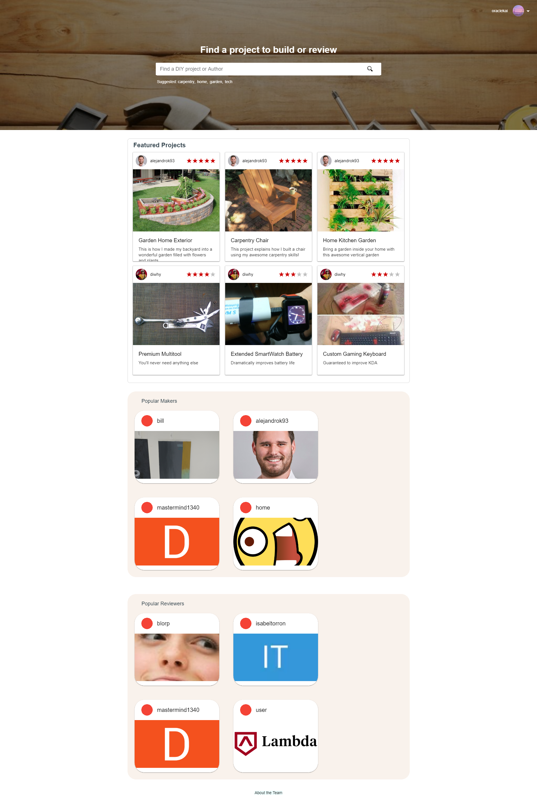

## Week 4
This week has been riddled with external issues not related to the project. My mind has been all over the place, but I've been trying to use the project as a distraction to little success. So with a lack of focus in mind, I've been having troubles getting the project page look the way I'd like. I need some time to get the social media links working as I've never messed with those and there has been some issues with the css on smaller screens. I need to do some reading to figure out which width scales I'd need to get the job done.

Lambda School brought up something called the ninety-ninety rule, which is a humorous saying that the first 90 percent of development time is dedicated to starting the project, and the remaining 10 percent requires another 90 percent of the development time. Which doesn't really make sense, but it drives home the fact that this is very hard work.

I'd say bug hunting is the easiest part, at least with our project as it's riddled with bugs. For instance, authentication only works if you sign in from the landing page. Any other page just breaks the process. I'd like to think this is a small issue, but in reality it's just one of the hundreds of bugs that can happen every day. I guess this boils down to I know what to avoid and the user doesn't. C'est la vie.

